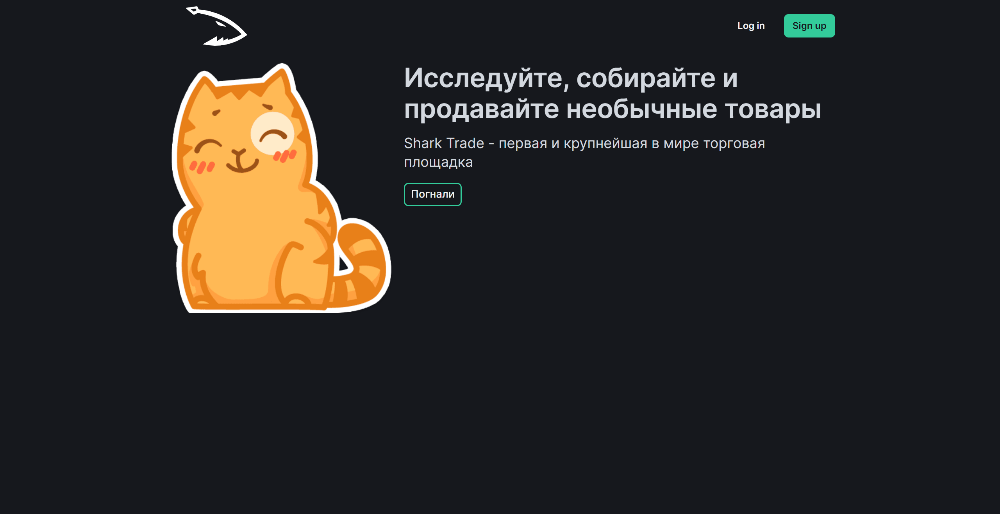
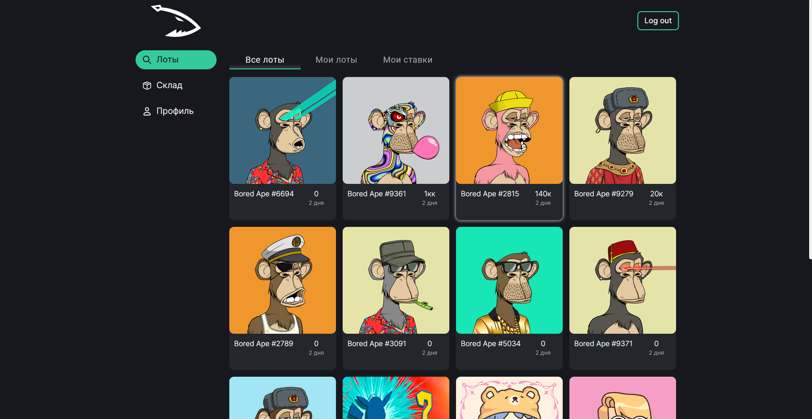
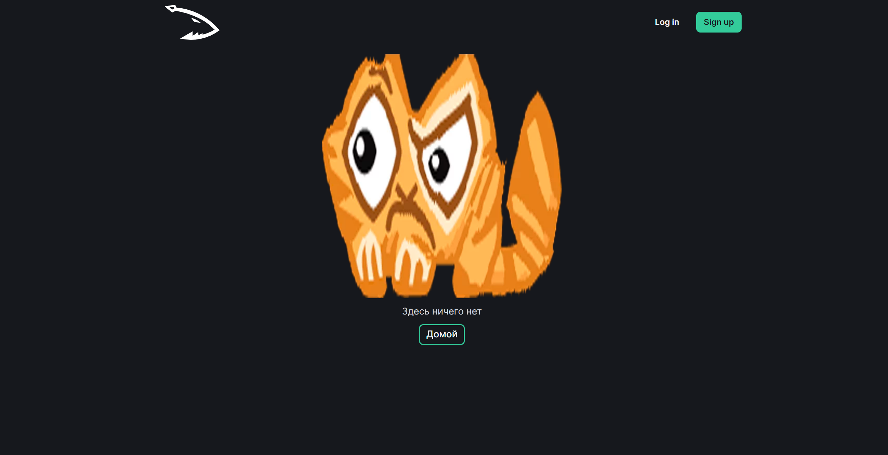

# Shark Trade

### Исследуйте, собирайте и продавайте необычные товары

---

## Техническая часть

## Deploy

Весь проект обмазан контейнерами (даже сборка фронтенда), поэтому деплой максимально прост:

1. Настраиваем переменные окружения:  
  В корне проекта (рядом с docker-compose.yaml) создаем файл .env и заполняем его следующими значениями:
  * `COMPOSE_PROJECT_NAME` - имя проекта для docker, будет использоваться 
     как приставка для названий контейнеров и всего остального
  * `APP_REPLICAS` - количество application контейнеров (вертикальное масштабирование)

  * `POSTGRESQL_USER` - имя пользователя postgres
  * `POSTGRESQL_PASSWORD` - пароль от postgres
  * `POSTGRESQL_DATABASE` - название базы данных в postgres

  * `REDIS_HOST` - адрес redis, достижимый из контейнеров -
  название сервиса с redis. Вставляем 'redis'
  * `DOCKER_POSTGRESQL_HOST` - адрес postgres, достижимый из контейнеров -
  название сервиса с postgres. Вставляем 'postgres'
  * `DEFAULT_POSTGRESQL_HOST` - адрес postgres вне контейнеров, вставляем 'localhost'

  * `RABBITMQ_HOST` - адрес RabbitMQ, достижимый из контейнеров -
  название сервиса с RabbitMQ. Вставляем 'rabbimq'
  * `RABBITMQ_USERNAME` - имя пользователя RabbitMQ
  * `RABBITMQ_PASSWORD` - пароль от RabbitMQ

  * `DEBUG` - переключатель режима разработки, True/False
  * `GLOBAL_DAEMONS_DEBUG` - то же самое, но отдельно для фоновых воркеров
(чтобы не спамили логами sql запросов)
  * `SERVER_URL` - адрес сервера, например: https://example.com

2. В папку docker_files закидываем ssl сертификат и его ключ под названиями `certificate.chained.crt` и `ssl.key`
3. Устанавливаем docker, docker-compose, python (желательно 3.10), с помощью pip прикручиваем alembic
4. Собираем образы и запускаем postgres:  
`docker-compose build && docker-compose up -d postgres`
5. Переходим в папку backend и загружаем чистую базу данных из миграций:  
`cd backend && alembic upgrade head`  
(ну или из дампа, если имеется)
6. Возвращаемся в корневой каталог и запускаем все остальные сервисы:  
`docker-compose up -d`

## Режим разработки
Тут всё аналогично секции Deploy, но используем docker-compose.dev.yaml, и не требуется ssl сертификат

## Обновление на сервере

Как было сказано, весь проект обмазан контейнерами.
Поэтому и обновление не вызовет особых трудностей

1. Загружаем коммиты:  
`git pull`  
2. Если есть новые миграции бд - скармливаем постгресу:  
`cd backend && alembic upgrade head`  
3. Пересобираем изображения и перезапускаем сервисы:  
`docker-compose build && docker-compose up -d`  

Всё. ¯\\_(ツ)_/¯